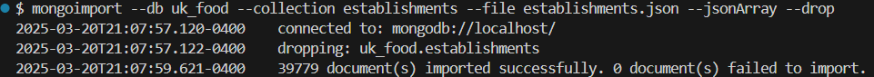
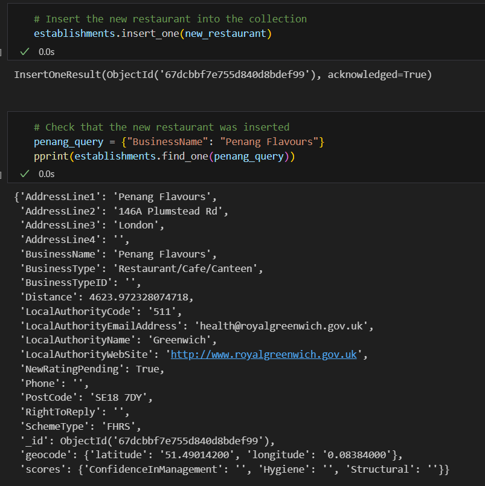
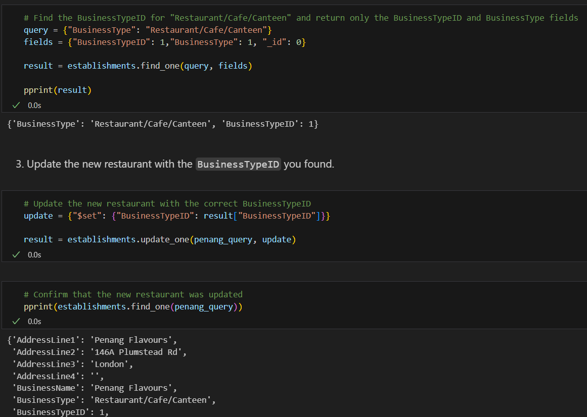
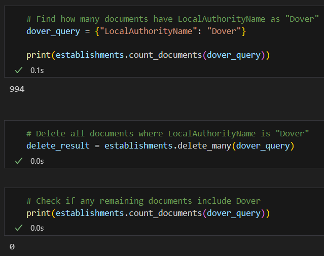
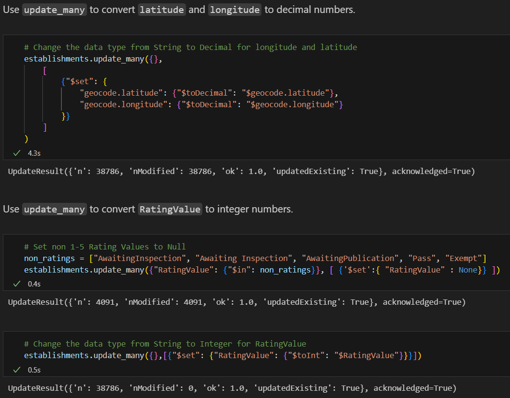
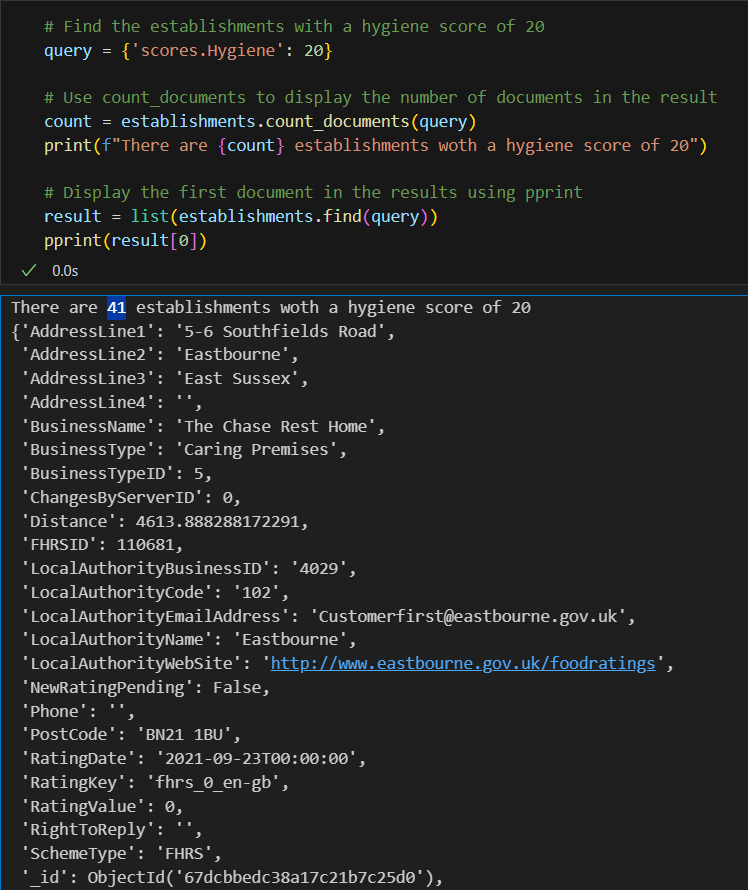
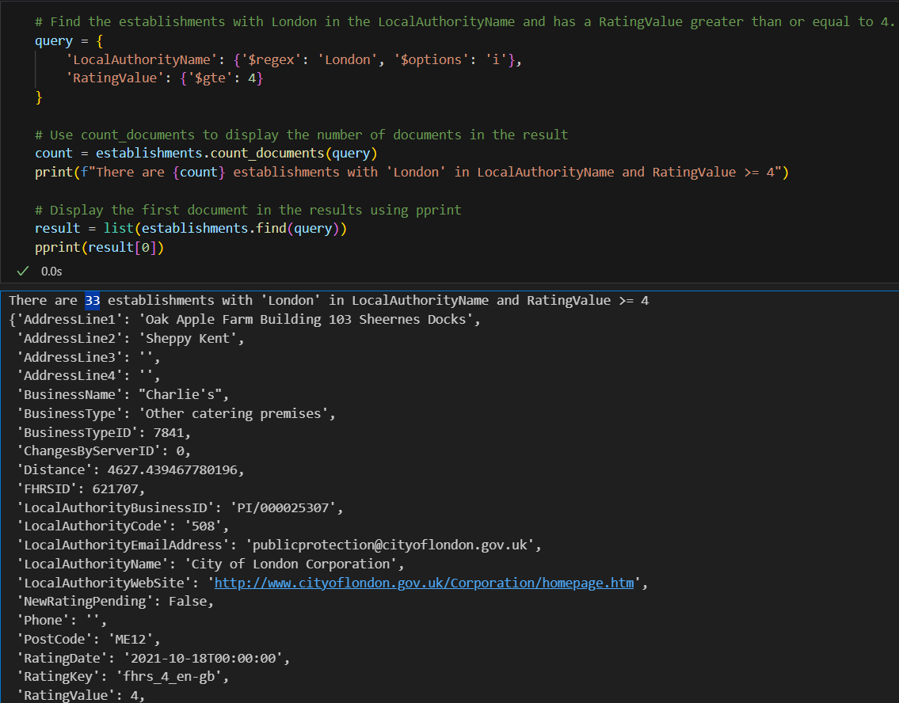
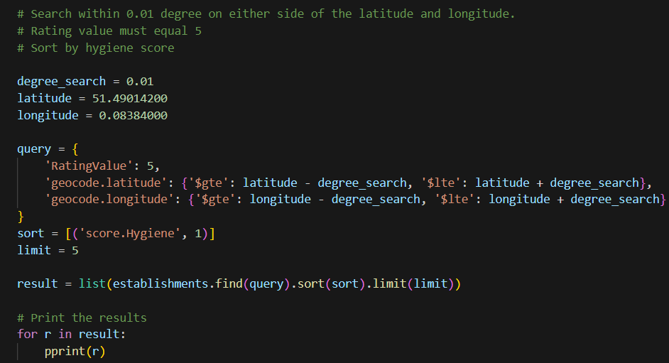
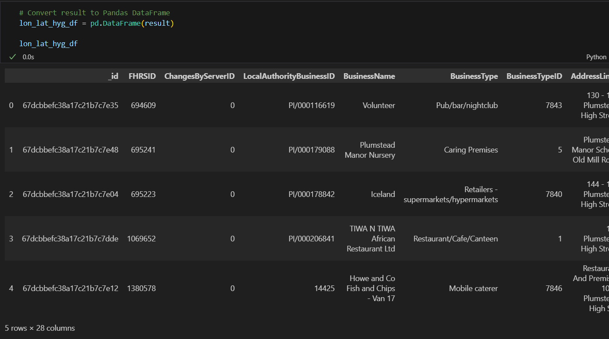
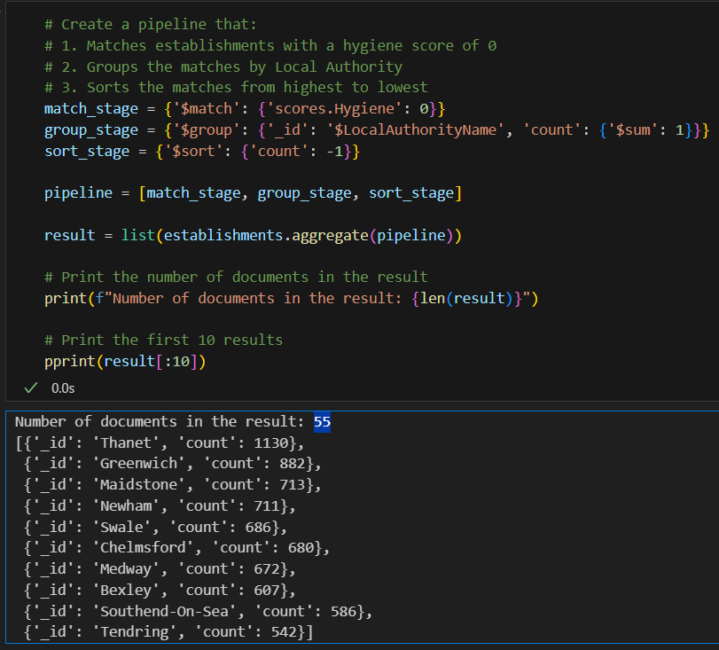

# No SQL Assignment

## Part 1 (Setup)
 All the code and the results for this part can be found in `NoSQL_setup_starter.ipynb` file.
 First, I imported the data using `mongoimport --db uk_food --collection establishments --file establishments.json --jsonArray --drop` command in my Terminal.
 I made sure that the mongoimport command text correctly drops any existing establishments collection before importing establishments.json into MongoDB:
 
 I updated the database by inserting the supplied data for the "Penang Flavours" restaurant into the establishments collection:
 
 I found the BusinessTypeID for "Restaurant/Cafe/Canteen" and updated the "Penang Flavours" document with the correct value:
 
 I deleted all the documents in the collection where "Dover Local Authority" is the value for LocalAuthorityName and performed a count_documents() check before and after the removal of the Dover documents to ensure the documents were removed:
 
 I performed an update_many() query to convert the latitude and longitude fields from strings to decimal numbers and RatingValue to integers:
 

## Part 2 (Analysis)
 Below you can see the code I've created for answering the questions. For all the questions, I casted the results as lists and creted DataFrames from them. All the code and the results can be found in `NoSQL_analysis_starter.ipynb` file.
### Question 1: Which establishments have a hygiene score equal to 20?
 
### Question 2: Which establishments in London have a RatingValue greater than or equal to 4?
 
### Question 3: What are the top 5 establishments with a RatingValue of 5, sorted by lowest hygiene score, nearest to the new restaurant added, "Penang Flavours"?
 
 
### Question 4: How many establishments in each Local Authority area have a hygiene score of 0? Sort the results from highest to lowest, and print out the top ten local authority areas?
 
